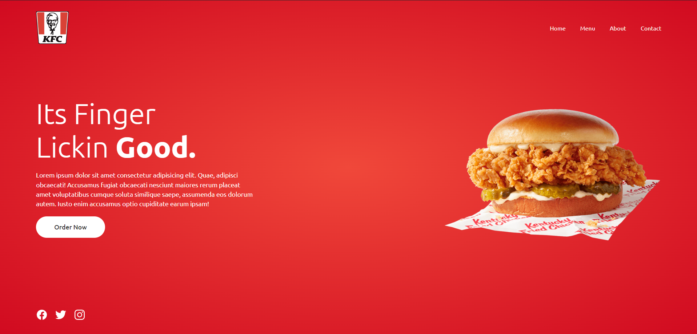

# KFC - Responsive Landing Page

Este es un proyecto de una página de inicio responsiva para KFC, que incluye un menú de navegación, una sección de contenido principal con una llamada a la acción y enlaces a redes sociales en el pie de página. La página cambia de tema entre modos oscuro y claro y se adapta a diferentes tamaños de pantalla.

## Tecnologías Utilizadas

- HTML5
- CSS3
- JavaScript
- Google Fonts (Ubuntu)
- Ionicons

## Estructura del Proyecto

```
├── css/
│   └── style.css
├── images/
│   └── logo.png
│   └── burger.png
├── index.html
└── script.js
```

## Características

- **Navegación:** Un menú de navegación que cambia de estilo en dispositivos móviles.
- **Contenido Principal:** Una sección principal con un título llamativo, un párrafo descriptivo y un botón de llamada a la acción.
- **Slider:** Un slider para mostrar imágenes de los productos.
- **Footer:** Enlaces a redes sociales en el pie de página.


## Uso

1. Clona el repositorio.
2. Abre `index.html` en tu navegador para ver la página en acción.
3. O bien entra al enlace: https://menu-pendente.netlify.app/

## Prueba en Vivo

Si quieres probar el proyecto, puedes hacerlo [aquí - Probar sitio](https://menu-pendente.netlify.app/).



## Contribuciones

Las contribuciones son bienvenidas. Por favor, abre un issue o un pull request para discutir cualquier cambio.


¡Gracias por visitar este proyecto! Esperamos que te guste y encuentres útil este ejemplo de una página de inicio responsiva.

